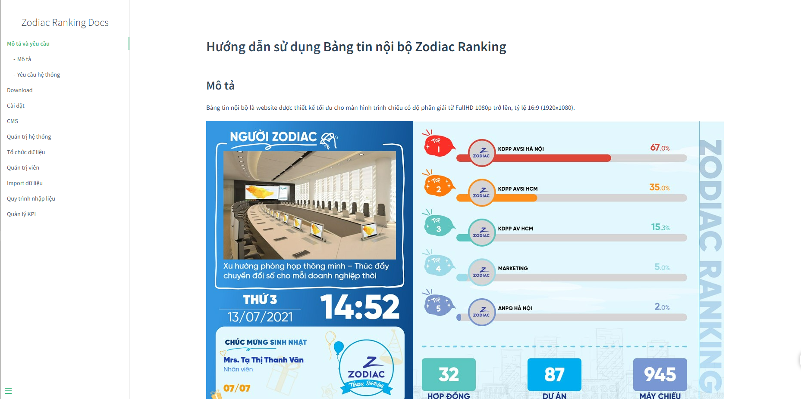
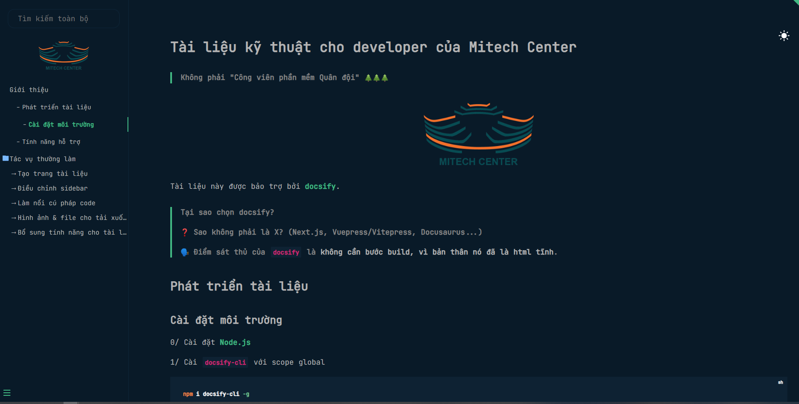
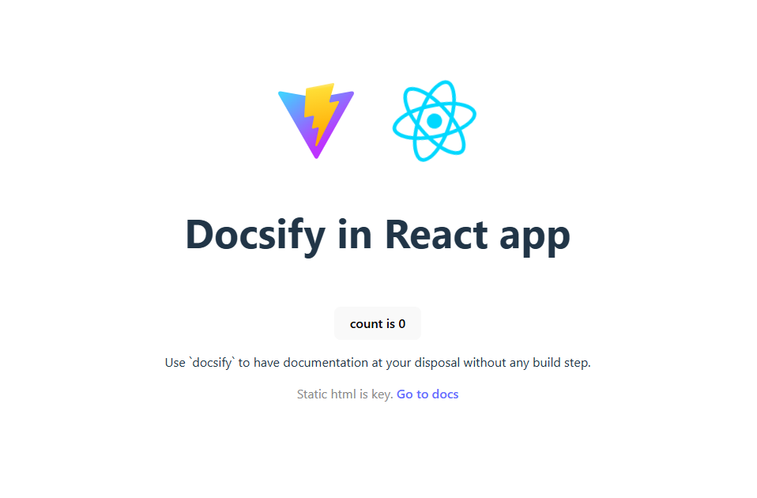

# Biên soạn tài liệu với Docsify

## Trước khi bắt đầu

> Node.js >= v10

Cài đặt docsify với scope global:

```sh
npm i docsify-cli -g
```

## Bắt đầu

Từ thư mục gốc, chạy:

```bash
npm start
```

hoặc chạy thẳng:

```sh
docsify serve ./user-docs
```

hoặc từ bên trong thư mục `user-docs`:

```sh
docsify serve .
```

Trang tài liệu được triển khai ở địa chỉ: [http://localhost:3000](http://localhost:3000)

## Hướng dẫn biên soạn

Nội dung tài liệu nằm trong thư mục `user-docs`.

- Nội dung trang chủ nằm tại: `user-docs/readme.md`.
- Nội dung thanh điều hướng nằm tại: `user-docs/_sidebar.md`.
- Nội dung trang sẽ được render trên trang html `user-docs/index.html`.
- Các file tài nguyên: hình ảnh, video, MS Word, PDF... lưu tại `user-docs/assets`.

Các file còn lại là các trang nội dung viết bằng Markdown.

## Deploy

Chỉ đơn giản là bê tất cả nội dung của thư mục `user-docs` và đưa lên server làm web tĩnh.

## Các project mẫu / Trường hợp sử dụng

### `user-docs`

Tài liệu hướng dẫn sử dụng cho người dùng cuối.



### `technical-docs-dark-mode`

Tài liệu kỹ thuật có chế độ nền tối.



### `within-react-spa`

Minh họa cách sử dụng docsify để viết tài liệu trong ứng dụng React (thuần SPA).

Cách sử dụng:

```sh
cd within-react-app
npm install && npm run dev
```

Đi đến tài liệu tại địa chỉ [http://localhost:5173/docs/index.html](http://localhost:5173/docs/index.html).



## Tra cứu

[Tài liệu chính thức của Docsify](https://docsify.js.org/#/)
