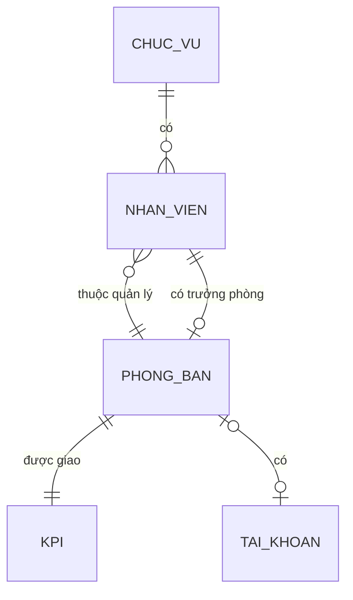
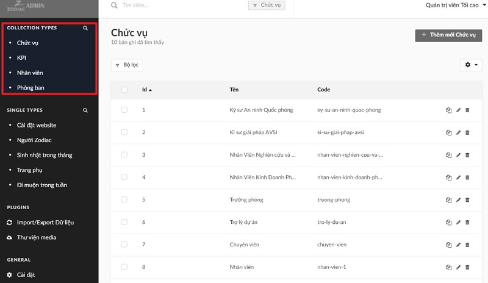

# Tổ chức dữ liệu

**Diễn giải**

- Mỗi `Nhân viên` có 1 và chỉ 1 `Chức vụ`
- Mỗi `Nhân viên` thuộc quản lý của 1 và chỉ 1 `Phòng ban`
- Mỗi `Phòng ban` có thể có 0 hoặc 1 `Nhân viên` là trưởng phòng
- `Phòng ban` có thể được giao 0 hoặc 1 bản `KPI`, mỗi bản `KPI` thuộc về 1 và chỉ 1 `Phòng ban`
- `Phòng ban` có thể liên kết với 0 hoặc 1 `Tài khoản`, `Tài khoản` có thể được liên kết với 0 hoặc 1 `Phòng ban`

Các thực thể chính này được quản lý ở mục `Collection Types` trên menu cột bên trái. Về thực thể `Tài khoản`, xem thêm [Quản trị viên](user-role)

