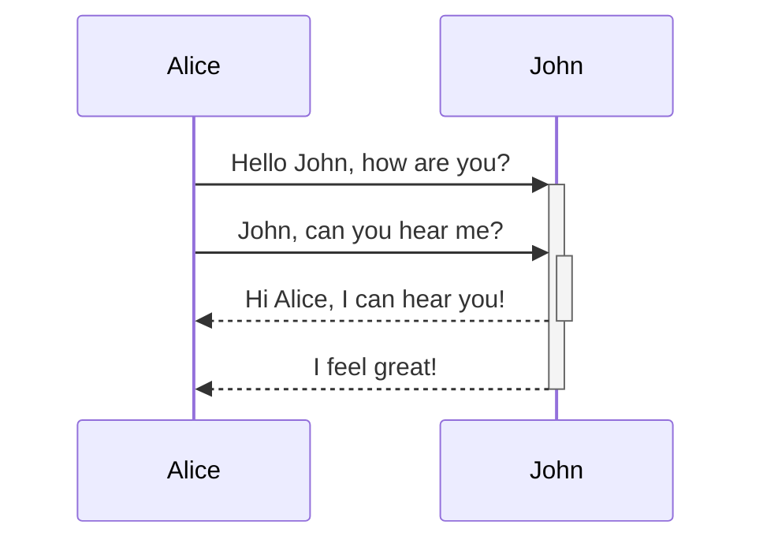

# Tài liệu kỹ thuật cho developer của Mitech Center

> Không phải "Công viên phần mềm Quân đội" :evergreen_tree::evergreen_tree::evergreen_tree:
<p style="text-align:center;">

</p>

Tài liệu này được bảo trợ bởi [docsify](https://docsify.js.org/).

> Tại sao chọn docsify?
>
> :question: Sao không phải là X? (Next.js, Vuepress/Vitepress, Docusaurus...)
> 
> :speaking_head: Điểm sát thủ của `docsify` là __không cần bước build, vì bản thân nó đã là html tĩnh__.

## Phát triển tài liệu

### Cài đặt môi trường

0/ Cài đặt [Node.js](https://nodejs.org/en)

1/ Cài `docsify-cli` với scope global

```sh
npm i docsify-cli -g
```

2/ Chạy server dev với live-reload

```sh
# Nếu code tài liệu nằm trong thư mục `docs`, từ thư mục cha gọi
docsify serve docs

# Từ bên trong thư mục `docs`
# Mặc định chạy ở port 3000
docsify serve .

# Từ bên trong thư mục `docs`
# Chạy ở port khác, ví dụ 5173
docsify serve . --port=5173
```

Đọc chi tiết [ở đây](https://docsify.js.org/#/quickstart).

## Tính năng hỗ trợ

### Markdown

Các file tài liệu được viết bằng [Markdown](https://www.markdownguide.org/).

Markdown, tên gọi thể hiện sự tương phản với ngôn ngữ siêu văn bản Markup như HTML, là một ngôn ngữ _văn bản thông thường_ với nhiều ưu điểm:

- Dễ đọc
- Dễ viết
- Code HTML là hoàn toàn hợp lệ trong Markdown
- Biên dịch dễ dàng sang HTML

Rất nhiều tính năng được hỗ trợ sau đây dựa trên Markdown.

### Dàn ý hai cột

Như đã nói, code HTML là hợp lệ trong Markdown, và `<!-- comment trong HTML -->` bên cạnh tác dụng chính, còn được hack bởi nhiều plugin để mở rộng tính năng cho Markdown. Để tạo dàn ý hai cột, ta sử dụng các comment đánh dấu sau:

- `<!-- panels:start -->`: bắt đầu khối dàn ý hai cột
- `<!-- div:title-panel -->`: nội dung sau đó là tiêu đề
- `<!-- div:left-panel -->`: nội dung sau đó cho cột bên trái
- `<!-- div:right-panel -->`: nội dung sau đó cho cột bên phải
- `<!-- panels:end -->`: kết thúc khối dàn ý hai cột

Xem minh họa cho dàn ý hai cột ở các tính năng phía sau.

<!-- panels:start -->

<!-- div:title-panel -->

### Tab

<!-- div:left-panel -->

```md
<!-- tabs:start -->

#### **English**

Hello!

#### **French**

Bonjour!

#### **Italian**

Ciao!

<!-- tabs:end -->
```

<!-- div:right-panel -->

<!-- tabs:start -->

#### **English**

Hello!

#### **French**

Bonjour!

#### **Italian**

Ciao!

<!-- tabs:end -->

<!-- div:title-panel -->

### Đồ thị

<!-- div:left-panel -->

[Charty cho phép vẽ đồ thị bằng mô tả Markdown](https://charty.docsify.markbattistella.com/).

~~~md
```charty
{
  "title":   "Area chart",
  "caption": "With a caption",
  "type":    "area",
  "options": {
    "legend":  true,
    "labels":  true,
    "numbers": true
  },
  "data": [
    {
        "label": "2010",
        "value": [120, 23, 45, 34, 52, 43, 59, 40]
    }
  ]
}
```
~~~

<!-- div:right-panel -->

```charty
{
  "title":   "Area chart",
  "caption": "With a caption",
  "type":    "area",
  "options": {
    "legend":  true,
    "labels":  true,
    "numbers": true
  },
  "data": [
    {
        "label": "2010",
        "value": [120, 23, 45, 34, 52, 43, 59, 40]
    }
  ]
}
```

<!-- div:title-panel -->

### Mermaid

<!-- div:left-panel -->

[Mermaid](https://mermaid.js.org/) là thư viện cho phép vẽ diagram thông qua mô tả markdown.

~~~md

~~~

Chơi với Mermaid [tại đây](https://mermaid.live/).

<!-- div:right-panel -->


<!-- div:title-panel -->

### Mind map

<!-- div:left-panel -->

[Markmap](https://markmap.js.org/) là một thư viện cho phép mô tả mind map bằng Markdown.

~~~md
```markmap
---
title: markmap
markmap:
  colorFreezeLevel: 2
---

# markmap

## beautiful

## easy

## interactive

## useful
```
~~~

<!-- div:right-panel -->

```markmap
---
title: markmap
markmap:
  colorFreezeLevel: 2
---

# markmap

## beautiful

## easy

## interactive

## useful

```

<!-- panels:end -->
