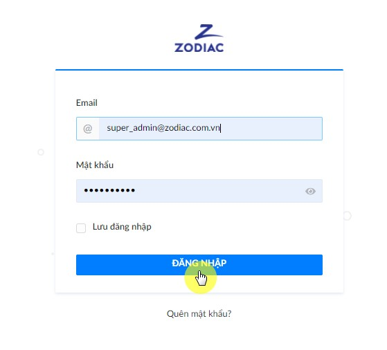
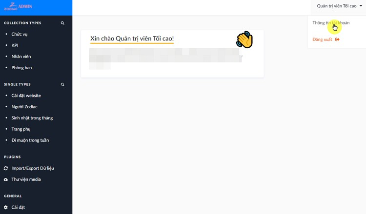
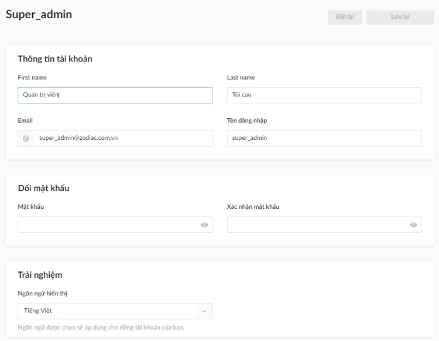
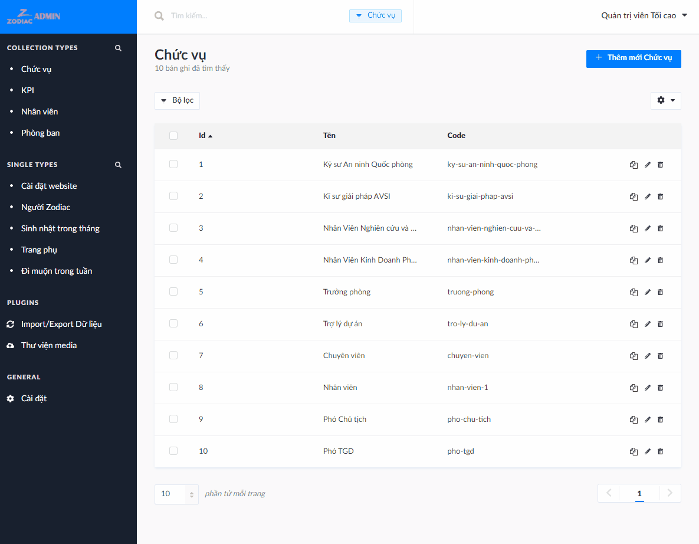

# Quản trị người dùng

## Vai trò và quyền

Người dùng trang quản trị được chia làm 3 loại ứng với 3 vai trò:

#|Tên vai trò|Quyền hạn|Phù hợp với
---|---|---|---
1|Quản trị viên tối cao|Có toàn quyền điều hành và cấu hình hệ thống|Quản trị hệ thống công ty
2|Quản trị nội dung công ty|Có quyền chỉnh sửa mọi nội dung trong công ty, trừ quản trị người dùng hệ thống và KPI|Nhân viên thông tin nội bộ
3|Biên tập viên phòng ban|Có quyền cập nhật KPI cho phòng ban mình phụ trách|Trưởng phòng

Hệ thống được cài đặt sẵn 2 tài khoản tương ứng với vai trò số 1 và 2.

#|Email đăng nhập|Mật khẩu mặc định|Vai trò
---|---|---|---
1|super_admin@zodiac.com.vn|Abc@159753|Quản trị viên tối cao
2|info@zodiac.com.vn|Abc@159753|Quản trị nội dung công ty

Chỉ vai Quản trị viên tối cao (QTVTC) mới có khả năng thêm xóa người dùng trong hệ thống.

Vai trò số 3 - **Biên tập viên phòng ban**, có liên quan đến dữ liệu KPI và phòng ban, **nên các tài khoản vai này sẽ được đồng bộ tự động với dữ liệu phòng ban**.

- Chỉ phòng ban nào có tham gia Zodiac Ranking (được xác định khi tạo phòng ban) mới có _tài khoản biên tập viên và bản KPI liên kết_
- Xóa phòng ban sẽ _xóa cả tài khoản và bản KPI liên kết_
- KPI không cho phép tạo hoặc xóa thủ công

> Trừ khi có lý do thật sự cần thiết, QTVTC không nên thêm thủ công người dùng với vai số 3 để tránh phát sinh lỗi do xung đột dữ liệu.

## Thay đổi thông tin tài khoản

Mật khẩu mặc định cho tài khoản quản trị viên (vai 1 và 2) là `Abc@159753`.

Mật khẩu mặc định cho tài khoản liên kết với phòng ban (vai 3) là `Abc123456`.

Tham khảo [tại đây](installation?id=cấu-hình-biến-hệ-thống) để cấu hình thay đổi mật khẩu mặc định.

- Đăng nhập

- Di chuyển đến trang thông tin tài khoản, thay đổi thông tin theo mong muốn và lưu lại

## Quản lý Vai trò và Người dùng

Khi đăng nhập bằng tài khoản QTVTC,

