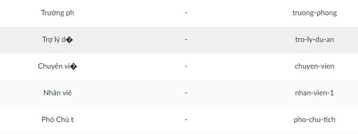
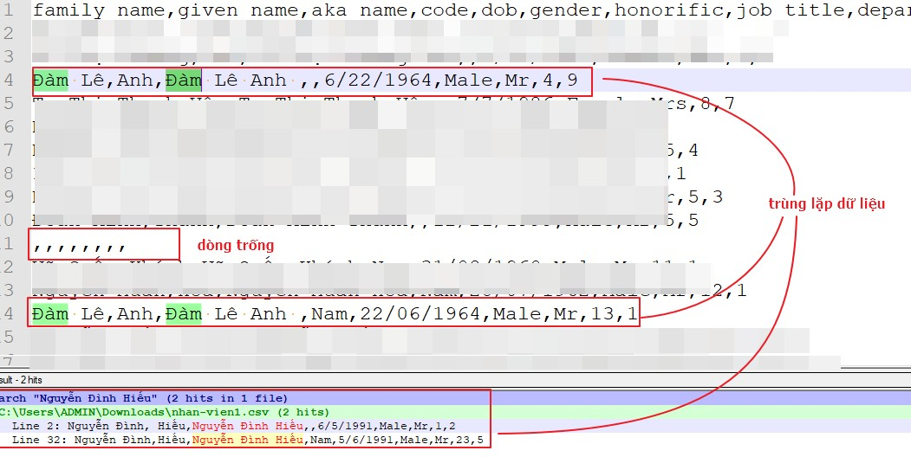
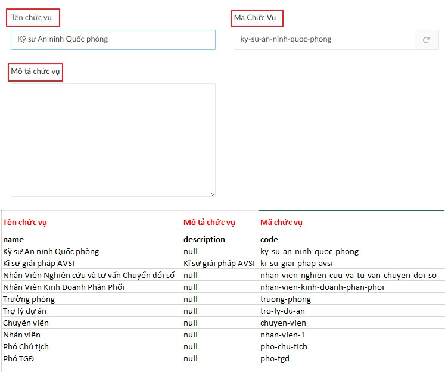
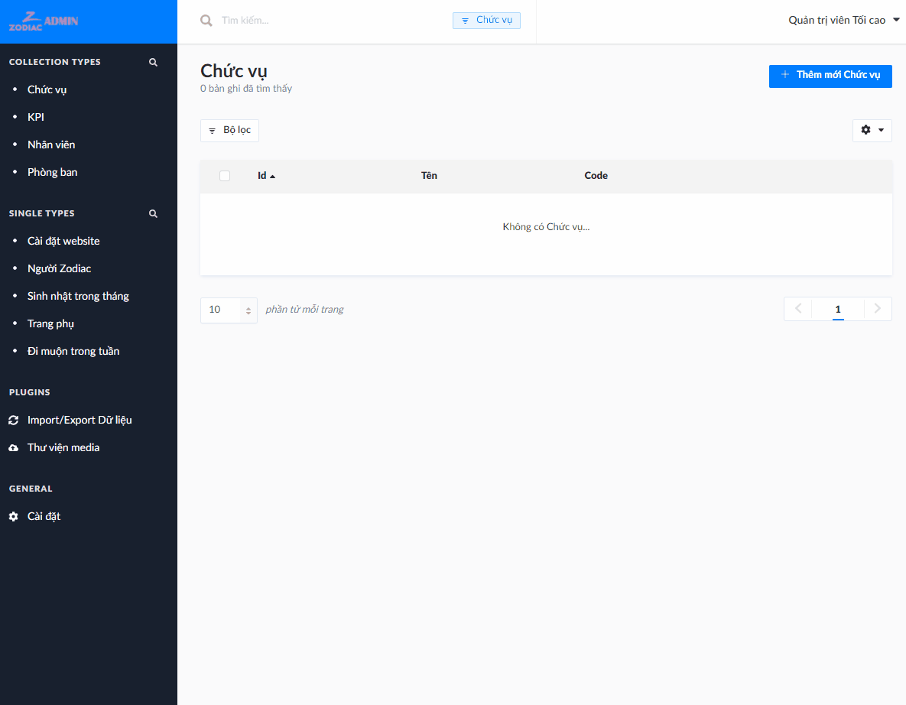

# Import dữ liệu

Hệ thống có chức năng Import theo định dạng JSON hoặc CSV hỗ trợ xây dựng dữ liệu nhanh chóng.

Các thực thể chính trong hệ thống đã có khung sườn dữ liệu ở định dạng CSV và JSON như sau.

#|Thực thể|CSV|JSON
---|---|---|---
1|Chức vụ|[Tải xuống](assets/csv/chuc-vu.csv ':ignore')|[Tải xuống](assets/json/chuc-vu.json ':ignore')
2|Phòng ban|[Tải xuống](assets/csv/phong-ban.csv ':ignore')|[Tải xuống](assets/json/phong-ban.json ':ignore')
3|Nhân viên|[Tải xuống](assets/csv/nhan-vien.csv ':ignore')|[Tải xuống](assets/json/nhan-vien.json ':ignore')

## Chọn định dạng file

### CSV

File CSV dàn dữ liệu theo chiều ngang, cho phép sử dụng Excel để chỉnh sửa, nên *phù hợp với người dùng phổ thông*.

> [Hướng dẫn chỉnh sửa CSV bằng Excel](https://help.dudesolutions.com/Content/Documentation/Maintenance/Asset%20Essentials/AddOns/ConnectorTool/CSV-Editing-with-Excel.htm)

Một số phiên bản Excel gặp vấn đề khi xử lý các ký tự không phải tiếng Anh.

Nếu rơi vào trường hợp này, bạn có thể sử dụng một trong số công cụ thay thế sau đây.

> [Hướng dẫn thao tác CSV bằng Google Sheets](https://www.organimi.com/how-to-convert-a-csv-file-to-google-sheets/)

> [Thao tác CSV online bằng editcsvonline](https://www.editcsvonline.com/)

### JSON

File JSON dàn dữ liệu theo chiều dọc theo cú pháp riêng, có thể chỉnh sửa được bằng bất cứ editor nào từ Notepad đến VSCode, hoặc các công cụ online. Định dạng này phù hợp với người có kiến thức về kỹ thuật như sysadmin hoặc dev.

> [Thao tác JSON online bằng jsoneditoronline](https://jsoneditoronline.org/)

## Cảnh báo khi biên tập

### Ràng buộc dữ liệu

Dữ liệu đưa vào import cần tuân thủ các ràng buộc sau nếu không sẽ báo lỗi:

- Các trường tên `id` hoặc `code` **phải có** giá trị duy nhất, nghĩa là nếu không để trống thì không thể có 2 hàng có `code` hoặc `id` giống nhau
- Các trường ngày tháng như sinh nhật **phải có** định dạng `YYYY-MM-DD`.
  Ví dụ: sinh nhật `25/12/1997` thì định dạng đưa vào là `1997-12-25`

### Dư thừa dữ liệu

Kết quả import không bị ảnh hưởng bởi dư thừa dữ liệu, nhưng gây ra mất thời gian chỉnh sửa sau khi import

- Không nên để dòng trống hoặc chỉ có dấu `,`
- Không nên để lặp lại các hàng giống nhau

## Bắt đầu import

Bài viết sẽ minh họa việc import dữ liệu "Chức vụ" vào hệ thống.

Tải xuống và mở file `chuc-vu.csv`. Hình dưới đây giải thích ý nghĩa từng cột, cũng là khớp tên các cột với tên trường khi tạo trên trang CMS.

Sau khi chỉnh sửa xong, ta mở trang CMS và thao tác như sau.

