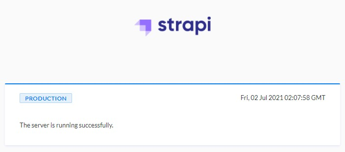
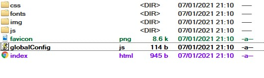

# Cài đặt

Bộ cài đặt gồm 3 phần tương ứng với 3 thư mục

- `backend`: CMS quản tri nội dung của bảng tin, chiếm nhiều tài nguyên nhất
- `frontend`: Phần website của bảng tin

`frontend` web tĩnh nên có thể triển khai ngay. Người dùng có thể tham khảo tài liệu tương ứng với webserver đang dùng.

- [IIS](https://docs.microsoft.com/en-us/iis/manage/creating-websites/scenario-build-a-static-website-on-iis)
- [Nginx](https://docs.nginx.com/nginx/admin-guide/web-server/serving-static-content/)

Phần còn lại sẽ hướng dẫn cách triển khai module CMS (từ đây gọi là `hệ thống`) trên server riêng của công ty.

Trước khi thực hiện các bước sau, hệ thống phải đảm bảo cấu hình và được cài đặt các thành phần đáp ứng [yêu cầu hệ thống](/).

> Từ đây về sau để ngắn gọn, các đường dẫn được quy ước hiểu là nằm trong thư mục `backend`. Trừ trường hợp được người viết chỉ rõ, còn không các bước thực hiện dưới đây đều ở trong thư mục `backend`.

## Cấu hình biến hệ thống

**Đường dẫn -** `.env`

```ini
APP_HOST='localhost'                        # địa chỉ server, nếu bỏ trống mặc định là `localhost`
PORT=1337                                   # port mà ứng dụng sẽ sử dụng
ADMIN_URL='/master'                         # path dẫn đến trang quản trị
FRONT_APP_URL='*'                           # cấu hình CORS: những client nào được phép nhận dữ liệu, mặc định là không giới hạn
DATABASE_FILENAME='.tmp/data.db'            # đường dẫn đến database
DEFAULT_SUPER_ADMIN_PASSWORD='Abc@159753'   # mật khẩu mặc định cho tài khoản thuộc role quản trị
DEFAULT_DEPARTMENT_ACC_PASSWORD='Abc123456' # mật khẩu mặc định cho tài khoản thuộc role biên tập viên phòng ban
```

## Tải thư viện

Hệ thống phụ thuộc vào code của nhiều thư viện khác, do vậy cần phải có các thư viện để hoạt động. Mở Terminal(Linux/MacOS) hoặc Powershell(Windows) và thực hiện các bước sau.

- Cài đặt `yarn`

```bash
npm install -g yarn
```

- Tải xuống thư viện phụ thuộc

```bash
yarn install --production=true
```

## Build hệ thống

```bash
NODE_ENV=production yarn build
```

## Khởi động hệ thống

- Cài đặt trình quản lý ứng dụng trong Node.js `pm2`

```bash
yarn global add pm2
```

- Khởi động hệ thống

```bash
pm2 start ecosystem.config.js
```


Đi đến [http://localhost:1337](http://localhost:1337), thấy như hình dưới là hệ thống đã chạy.



## Cấu hình proxy

Cấu hình webserver để chuyển tiếp các request từ port 80/443 về port hệ thống đang dùng (được cài đặt trong  file `.env`, mặc định `1337`)

## Kết nối frontend với backend

Di chuyển đến thư mục code frontend, sửa file `globalConfig.js` thành địa chỉ ngoại bộ của backend.



```js
// globalConfig.js
window.$app = {
  SERVER_URL: 'http://192.168.10.80' // Địa chỉ ngoại bộ của backend
}
```

Cuối cùng truy cập trang bảng tin và trang CMS để kiểm tra kết quả.
