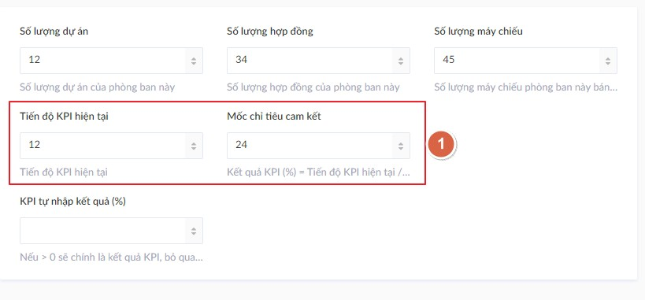
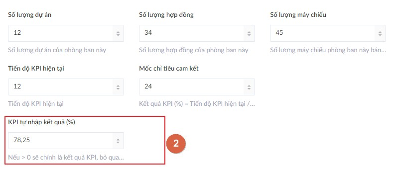
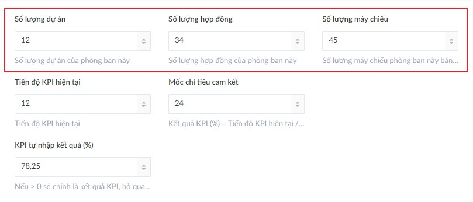

# Quản lý KPI

Quyền hạn quản lý KPI phụ thuộc vào vai trò của người dùng đăng nhập hiện tại.

#|Tên vai trò|Quyền hạn
---|---|---
1|Quản trị viên tối cao|Can thiệp được KPI của tất cả phòng ban
2|Quản trị nội dung công ty|Không xem được KPI
3|Biên tập viên phòng ban|Chỉ can thiệp được KPI của phòng ban liên kết với tài khoản của mình

Kết quả KPI được tính theo %. Hệ thống hỗ trợ 2 cách để đưa ra kết quả này.

## Tính KPI theo tiến độ



```txt
Kết quả KPI = 12 / 24 = 50%
```

## Tự nhập kết quả KPI



Nếu ô `KPI tự nhập kết quả (%)` được điền, __đó sẽ chính là kết quả KPI, bất kể 2 ô ở trên có nội dung như thế nào.__

## Doanh số



Mỗi khi người dùng lưu lại phản ánh doanh số của máy chiếu, dự án hoặc hợp đồng __TĂNG__, bảng tin `frontend` sẽ tạo popup chúc mừng, bao nhiêu thông số tăng thì bấy nhiêu popup. _Rõ ràng khi doanh số giảm thì sẽ không có popup nào cả_.


