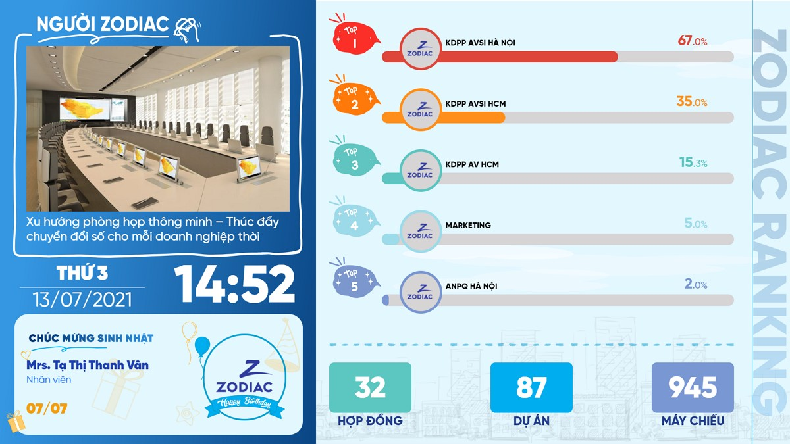

# Hướng dẫn sử dụng **Bảng tin nội bộ Zodiac Ranking**

## Mô tả

Bảng tin nội bộ là website được thiết kế tối ưu cho màn hình trình chiếu có độ phân giải từ FullHD 1080p trở lên, tỷ lệ 16:9 (1920x1080).

Các nội dung trên màn hình có thể thay đổi nhờ vào trang quản trị nội dung CMS riêng biệt.Các nội dung được cập nhật ngay lập tức khi lưu thay đổi từ phía CMS mà không cần tải lại trang.

## Yêu cầu hệ thống

### Công nghệ

- Node.js LTS (v12 hoặc v14)
- NPM v6 (đã đi kèm khi cài đặt Node)
- Build tools (`build-essential` trên các OS hệ Debian)

### Phần cứng

- Ít nhất 1 core CPU (khuyến khích 2 nhân trở lên)
- Ít nhất 2GB RAM (khuyến khích 4GB trở lên)
- ít nhất 1GB ổ cứng trống (khuyến khích 32GB trống)

### Database

- SQLite >= 3

### OS

- Ubuntu >= 18.04 (LTS-Only)
- Debian >= 9.x
- CentOS/RHEL >= 8
- macOS Mojave or newer (ARM không được hỗ trợ)
- Windows Server >= 2012
- Docker
