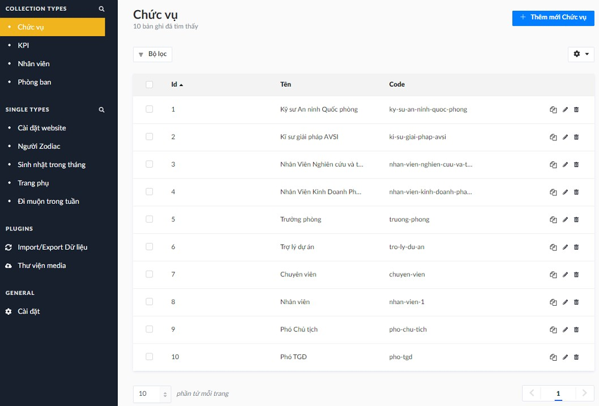
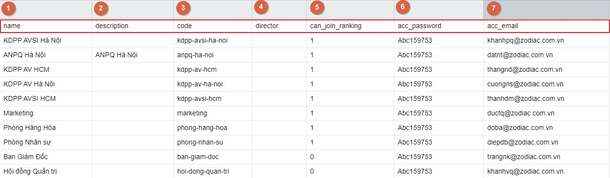
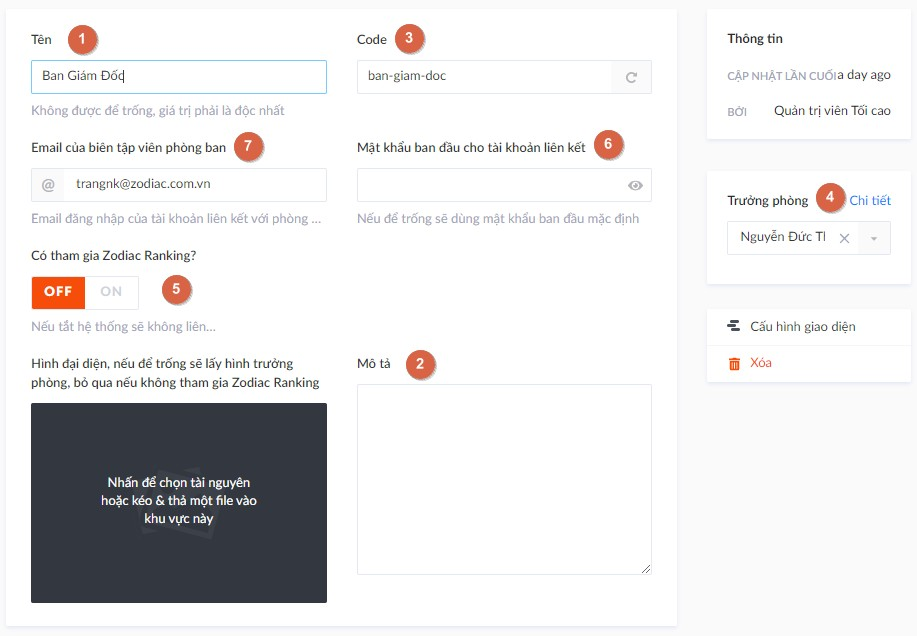
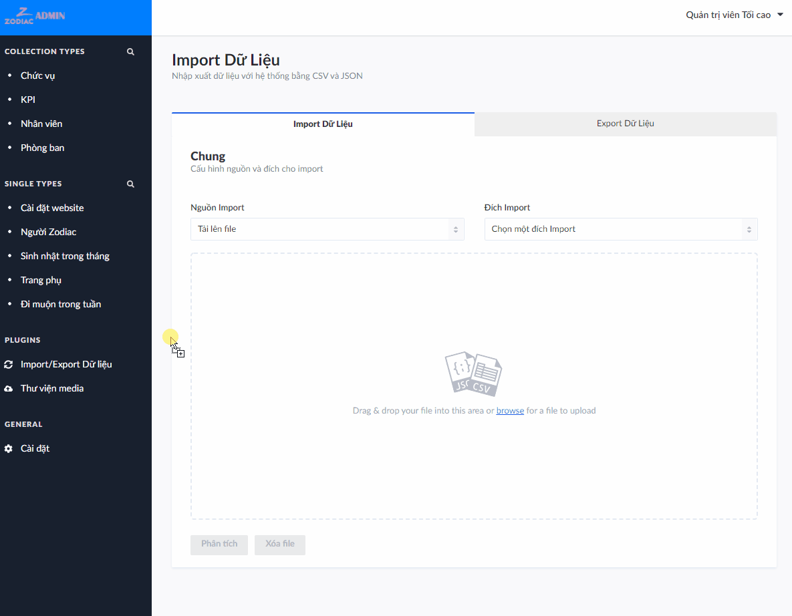
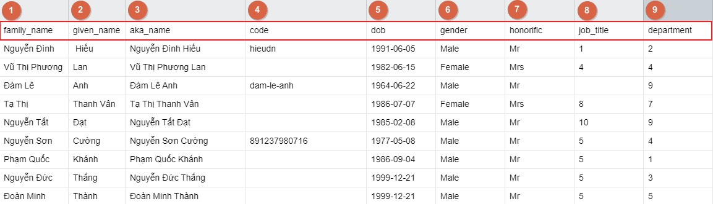
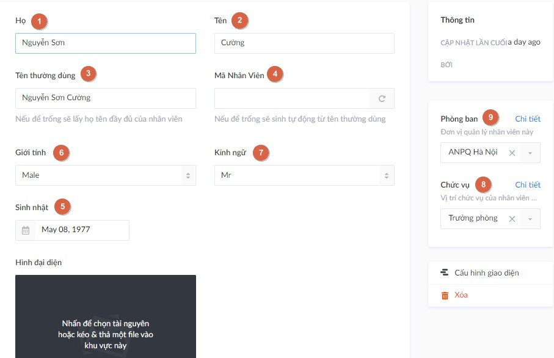
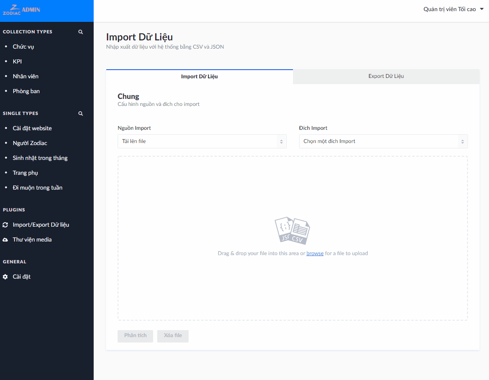
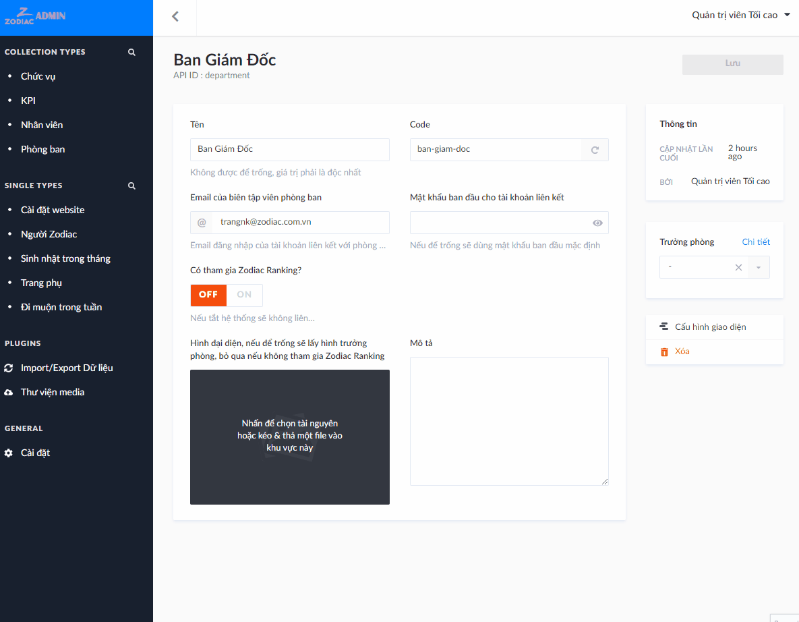

# Quy trình nhập liệu

Quy trình nhập liệu được xây dựng dựa trên [mối quan hệ giữa các thực thể](entities).

#|Thực thể|CSV|JSON
---|---|---|---
1|Chức vụ|[Tải xuống](assets/csv/chuc-vu.csv ':ignore')|[Tải xuống](assets/json/chuc-vu.json ':ignore')
2|Phòng ban|[Tải xuống](assets/csv/phong-ban.csv ':ignore')|[Tải xuống](assets/json/phong-ban.json ':ignore')
3|Nhân viên|[Tải xuống](assets/csv/nhan-vien.csv ':ignore')|[Tải xuống](assets/json/nhan-vien.json ':ignore')

Xem thêm [hướng dẫn import dữ liệu](import-content?id=bắt-đầu-import) nếu chưa biết.

Các bước quy trình dưới đây được minh họa với file CSV.

## Bước 1: Import Chức vụ

Tải xuống và mở file `chuc-vu.csv`. Hình dưới đây giải thích ý nghĩa từng cột, cũng là khớp tên các cột với tên trường khi tạo trên trang CMS.

Kết quả minh họa.

## Bước 2: Import Phòng ban

Tải xuống và mở file `phong-ban.csv`. Hình dưới đây giải thích ý nghĩa từng cột, cũng là khớp tên các cột với tên trường khi tạo trên trang CMS.

1. Tên đơn vị (*)
2. Mô tả đơn vị
3. Code/Mã đơn vị, nếu để trống sẽ tự động sinh từ tên đơn vị
4. ID của Nhân viên giữ chức trưởng phòng. **Nếu chưa có dữ liệu Nhân viên, để trống cột này và thêm ở bước 4**
5. Xác định đơn vị này có tham gia thi đua KPI trên Zodiac Ranking không? Nếu có (`1`), hệ thống sẽ __tự động sinh 1 bản KPI và 1 tài khoản biên tập viên liên kết với đơn vị này khi tạo thành công__. Nếu không (`0`), chỉ tạo đơn vị mà thôi. Do đó cần chú ý đặt chính xác giá trị cho trường này khi tạo đơn vị (*)
6. Mật khẩu ban đầu cho tài khoản liên kết. Có thể bỏ qua nếu mục 5 đặt là `0`
7. Email đăng nhập của tài khoản liên kết.  Có thể bỏ qua nếu mục 5 đặt là `0`

_(*) Các trường bắt buộc phải nhập nếu không sẽ báo lỗi khi import_

Sau khi chỉnh sửa xong, thực hiện import và kiểm tra kết quả.

## Bước 3: Import Nhân viên

Tải xuống và mở file `nhan-vien.csv`. Hình dưới đây giải thích ý nghĩa từng cột, cũng là khớp tên các cột với tên trường khi tạo trên trang CMS.

1. Họ và tên đệm nhân viên (*)
2. Tên nhân viên (*)
3. Tên thường dùng của nhân viên, nếu để trống sẽ là đặt là họ tên đầy đủ
4. Mã nhân viên, bất cứ giá trị gì đặc trưng cho nhân viên, nếu để trống sẽ sinh tự động từ tên thường dùng
5. Sinh nhật của nhân viên
6. Giới tính của nhân viên, nhận 1 trong các giá trị

- `Male` - Nam
- `Female` - Nữ
- `Other` - Khác

7. Kính ngữ, nhận 1 trong các giá trị

- `Mr`
- `Mrs`
- `Ms`

8. Chức vụ của nhân viên, chọn ID tương ứng với một Chức vụ được tạo ở bước 1
9. Phòng ban quản lý nhân viên, chọn ID tương ứng một Phòng ban được tạo ở bước 2

_(*) Các trường bắt buộc phải nhập nếu không sẽ báo lỗi khi import_

Sau khi chỉnh sửa xong, thực hiện import và kiểm tra kết quả.

# Bước 4: Liên kết trưởng phòng

Dữ liệu Nhân viên và Phòng ban đã có cho phép người dùng có thể vào từng phòng ban và chỉ định nhân viên làm trưởng phòng.

